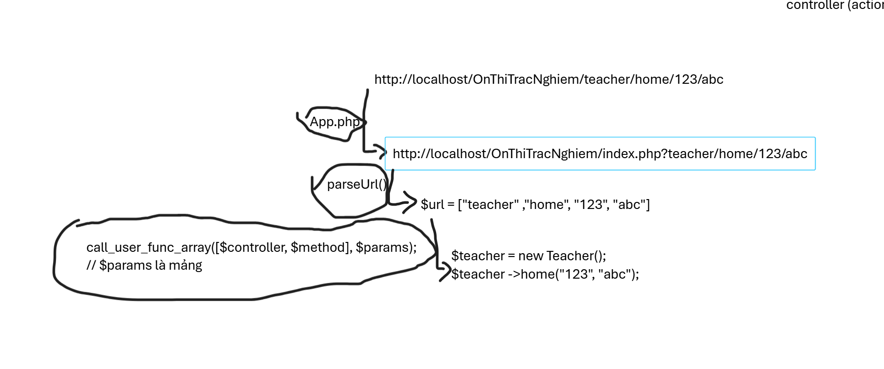

# MindQuest
## Luồng hoạt động của Ứng dụng
### 1. Cấu trúc thư mục
```
├───.vscode
├───app
│   ├───controllers
│   ├───core       
│   ├───database  
│   ├───includes
│   ├───models
│   ├───storages
│   └───views
│       ├───auth
│       ├───giaovien
│       │   ├───pages
│       │   └───partials
│       ├───hocsinh
│       │   ├───pages
│       │   └───partials
│       └───layouts
├───config
├───docs
└───public
    ├───css
    ├───image
    └───js

```
### 2. Giải  rewrite URL và cấu trúc thư mục
- __Chức năng từng folder__:
  - `controlle` : chứa các class Controller, chuyên nhận dự liệu trả về của `model` và gửi `$data[]` cho view hiển thị hoặc trả về json dùng cho công nghệ ajax
  - `core` : chứa các file cốt lõi cơ sở của dự án(hạn chế chính sửa code file này)
  - `database` : chứa file sql csdl của dự án
  - `include` : chứa các file tiện dụng,thường được dùng ở nhiều nơi trong dự án
  - `models`: chứa các class Model với thao tác chính là lấy dự liệu từ csdl và gửi về cho controller xử lí
  - `storages` : folder lưu trữ các file được client gửi về server
  - `view` : file chứa các mã html hiển thị lên trình duyệt client
  - `view/auth` : chứa các trang đăng nhập đăng kí (`dangky.php`,  `dangnhap.php`)
  - `view/"vai trò"/partials` :  chứa thành phần con của layout như `menu.php` sidebarmenu được hiển thị bởi biển `$sidebar` trong file `layout/main_layout.php` chứa mã html được xử lí từ controller 
  - `view/"vai trò"/pages` : chứa các trang hiển thị chính, được hiển thị bởi biến `$content` trong file layout chung `layout/main_layout.php`
- __Các file cơ sở__:
```
D:.
│   .htaccess
│   index.php
│   README.md
│
├───.vscode
│       launch.json
│
├───app
│   ├───controllers
│   │       Auth.php
│   │       Dashboard.php
│   │       Student.php
│   │
│   ├───core
│   │       App.php
│   │       Autoloader.php
│   │       Controller.php
│   │       DB.php
│   │       Model.php
│   │
│   ├───database
│   │       db.sql
│   │
│   ├───includes
│   │       ErrorDisplay.php
│   │       helper.php
│   │
│   ├───models
│   │       CauHoiDeThiModel.php
│   │       CauHoiModel.php
│   │
│   └───views
│       │   dashboard.php
│       │
│       ├───auth
│       │       dangky.php
│       │       dangnhap.php
│       │
│       ├───giaovien
│       │   ├───pages
│       │   │       quan-ly-lop.php
│       │   │
│       │   └───partials
│       │           menu.php
│       │
│       ├───hocsinh
│       │   ├───pages
│       │   │       tat-ca-cac-lop.php
│       │   │
│       │   └───partials
│       │           menu.php
│       │
│       └───layouts
│               main_layout.php
│
├───config
│       constants.php
│       DBconfig.php
│
├───docs
│       db_tables_description.md
│       kekhoach.md
│       session_cookie_variables.md
│
├───public
│   ├───css
│   │       layout.css
│   │       main.css
│   │       style.css
│   │
│   ├───image
│   │       thuvien.jpg
│   │
│   └───js
│           form_tao_lophoc.js
│           lam-bai.js
│
└───storages

```

- `.htaccess`: File cấu hình Apache để viết lại URL. Ví dụ, chuyển đổi từ `localhost/OnThiTracNghiem/auth/login/123` thành `localhost/OnThiTracNghiem/index.php?url=/auth/login/123`.

- `index.php`: File khởi chạy chính của ứng dụng. Nó nhận mọi request từ trình duyệt, khởi tạo ứng dụng và trả về phản hồi tương ứng.

- `App.php`: Lớp quản lý router. File này nhận URL từ `$_GET['url']`, phân tích và xử lý để gọi đúng controller, action, và truyền tham số vào action tương ứng.

- `Autoloader.php`: File hỗ trợ tự động tải các class theo namespace. Namespace gốc là `App`, nằm trong thư mục `app`. Loại bỏ việc phải sử dụng `require_once` thủ công.

- `Controller.php`: Lớp cơ sở cho tất cả các controller. Nó cung cấp các phương thức như `model()` để tải model và `view()` để tải view.

- `Model.php`: Lớp cơ sở cho tất cả các model. Nó thiết lập kết nối cơ sở dữ liệu thông qua PDO và cung cấp các phương thức để thực hiện truy vấn SQL.

- `DB.php`: Lớp quản lý kết nối cơ sở dữ liệu. File này chứa các thông tin cấu hình và phương thức để kết nối với cơ sở dữ liệu.

- `ErrorDisplay.php`: File tiện ích để hiển thị lỗi dễ nhìn hơn dưới dạng bảng

- `helper.php`: File chứa các hàm tiện ích được sử dụng ở nhiều nơi trong dự án, giúp giảm thiểu việc lặp lại mã nguồn.


- `main_layout.php`: File layout chính cho giao diện. Nó định nghĩa cấu trúc HTML cơ bản và sử dụng các biến như `$content` và `$sidebar` để hiển thị nội dung động từ các view.

### 3. Ảnh minh họa


## Cách fontend hoạt động
### Lấy data từ backend
- dữ liệu từ controller gửi về cho view được lưu trong biến `$data[]` dưới dạng mảng
- trong data có 2 key đặt biệt là `CSS_FILE` và `JS_FILE` để chứa các file css và js cần thiết cho trang
- các partial được hiển thị trong layout bằng biến `$sidebar` và `$content`
- `$content` là file chính hiển thị nội dung của trang, thường là file trong thư mục `pages` của view
- `$sidebar` là file hiển thị các thành phần phụ như menu, thường là file trong thư mục `partials` của view
- `$css_file` và `$js_file` là các biến chứa mã html để nhúng file css và js vào layout 
  ```
  <?=$data['css_file']?>
  tương đương
  <?php echo "<link rel='stylesheet' href='public/css/style.css'>"; ?>
  //nếu nội dung của $data['css_file'] là "<link rel='stylesheet' href='public/css/style.css'>"

  <?=$data['js_file']?>
  tương đương
  <?php echo "<script src='public/js/script.js'></script>"; ?>
  ```
